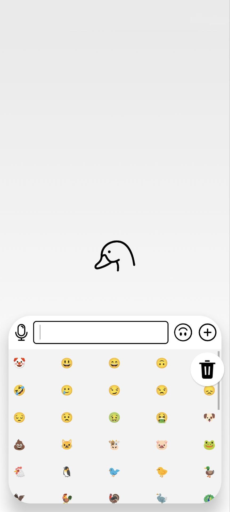
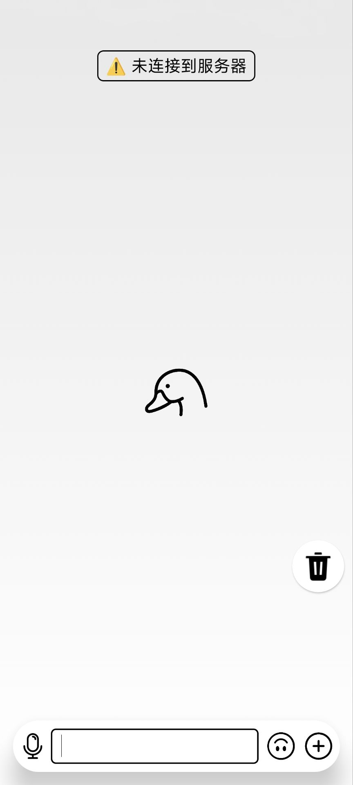
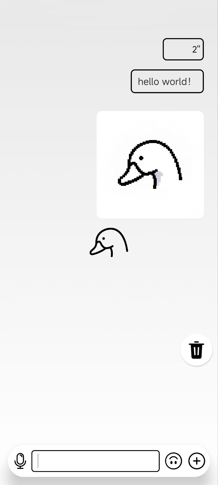

###  **聊天软件项目**

1. 项目UI[源码](https://github.com/damaingo/message/tree/main/messageUI)
2. 服务器[源码](https://github.com/damaingo/message/tree/main/message.server)
---
 ### **UI展示**

  
  

  
  

**对上分别展示了6种不同状态下的UI界面** 

**除了拍摄，语音通话、视频通话外一切功能正常**
### **介绍**
1. 通讯是用socket写的`socket = luajava.newInstance("java.net.Socket")`
2. 消息存到了子目录下，没用数据库（以深刻认识到数据库的重要性）
3. 子线程负责数据收发，主线程负责ui更新
4. 缺点没用数据库，删除控件不能移动，视频语音拍摄功能缺失，不能发视频文件，下次补齐
5. 语音界面和表情界面有点丑，这没有想法，其他的自我感觉还行

## 软件下载[链接](message.apk)
